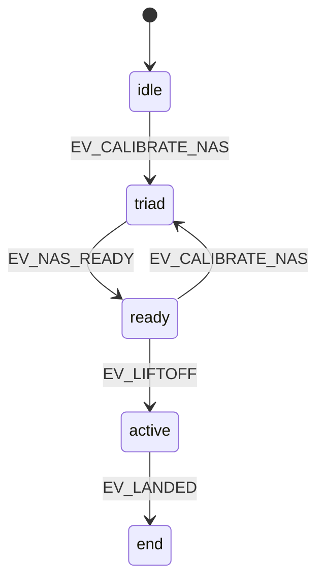

```mermaid
stateDiagram-v2
    [*] --> idle
    idle --> triad : EV_CALIBRATE_NAS
    triad --> ready : EV_NAS_READY
    ready --> active : EV_LIFTOFF
    ready --> triad : EV_CALIBRATE_NAS
    active --> end : EV_LANDED
```
