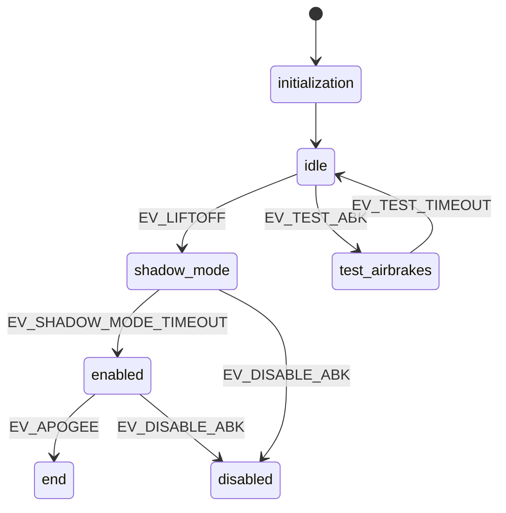

```mermaid
stateDiagram-v2
    [*] --> initialization
    initialization --> idle
    idle --> shadow_mode : EV_LIFTOFF
    idle --> test_airbrakes : EV_TEST_ABK
    shadow_mode --> enabled : EV_SHADOW_MODE_TIMEOUT
    shadow_mode --> disabled : EV_DISABLE_ABK
    enabled --> end : EV_APOGEE
    enabled --> disabled : EV_DISABLE_ABK
    test_airbrakes --> idle : EV_TEST_TIMEOUT
```